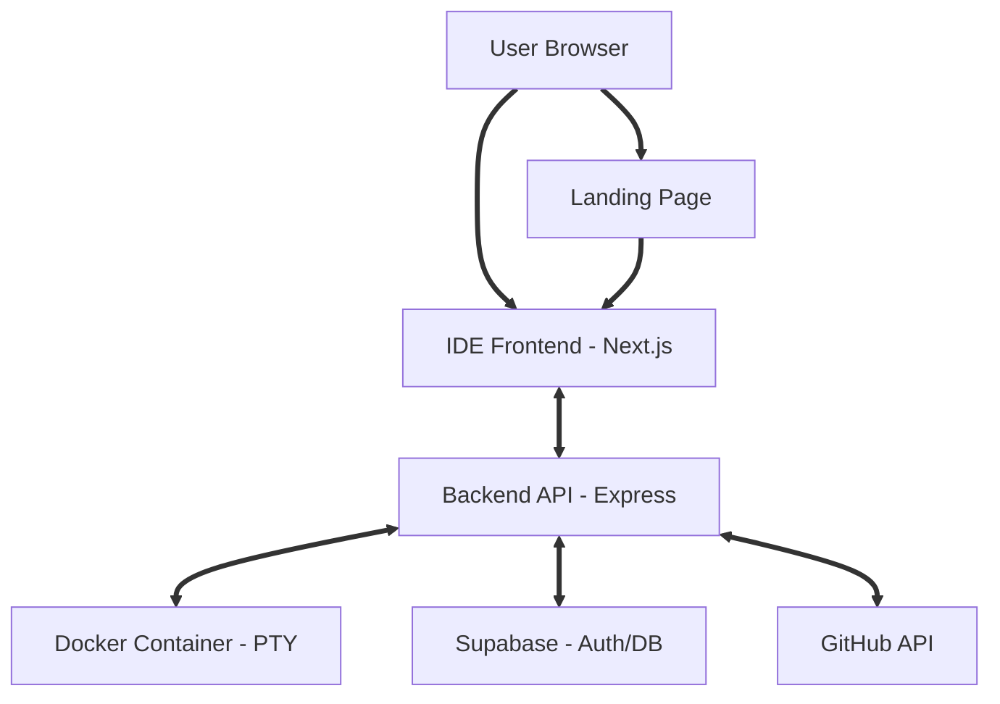

<div align="center">
  

  # 🚀 Code Forge Hub
  ### A Premium Cloud-Native IDE for the Modern Web

  [](https://github.com/)
  [](https://nextjs.org/)
  [](https://www.typescriptlang.org/)
  [](https://www.docker.com/)
  [](https://supabase.com/)
  [](LICENSE)

  [Features](#-features) • [Architecture](#-architecture) • [Tech Stack](#-tech-stack) • [Quick Start](#-quick-start) • [API](#-api-reference)
</div>

---

## � Introduction

**Code Forge Hub** is a premium, cloud-powered IDE designed to bring the power of VSCode directly to your browser. Whether you're importing a local project or connecting to GitHub, Code Forge Hub provides a seamless, zero-latency development environment with integrated containerization.

## ✨ Features

### 💻 IDE Experience
- **� Pro File Explorer** – Tree-based management with recursive operations.
- **📝 Monaco Engine** – Powered by the same engine as VSCode for an industry-standard experience.
- **🖥️ Real-time PTY Terminal** – Fully functional Linux terminal with multiple shell support.
- **💾 Smart Autosave** – Intelligent, debounced saving logic keeps your focus on the code.

### 🚀 Advanced Integration
- **� Local Folder Import** – **(New!)** Upload local directories directly. We handle the GitHub repo creation and initial push automatically.
- **🔗 GitHub Native** – Direct integration with GitHub for cloning, committing, and pushing changes.
- **📦 Managed Environments** – One-click setups for **Node.js**, **Python**, and **Java** runtimes.

### � Design & UX
- **🌓 Glassmorphic UI** – A stunning, modern interface with deep transparency and blur effects.
- **📐 Elastic Layout** – Draggable, resizable panels for a custom workspace.
- **⚡ Zero-Latency** – Background container pre-warming ensures your workspace is ready before you are.

---

## 🌐 Landing Page

Code Forge Hub features a high-conversion, standalone marketing site designed with standard-setting aesthetics.

- 💎 **Pixel-Perfect**: High-fidelity glassmorphism and smooth motion graphics.
- 📱 **Adaptive**: Fully responsive across ultra-wide monitors and mobile devices.
- ⚡ **Optimized**: Static Site Generation (SSG) for instant load times and SEO.

---

## 🏗️ Architecture



```text
CodeForge-Hub/
├── 🌐 landing-page/   # Marketing & Conversion
├── 💻 frontend/       # Core IDE Application
├── ⚙️ backend/        # Process & Container Orchestration
├── 🐳 docker/         # Isolation & Runtime Definitions
└── 🛠️ scripts/        # Automation & Deployment
```

---

## 🛠️ Tech Stack

| Type | Technology | Logo |
| :--- | :--- | :---: |
| **Frontend** | Next.js 15, Framer Motion, Zustand | ⚛️ |
| **Backend** | Node.js, Express, Socket.io | 🟢 |
| **Terminal** | XTerm.js, Node-PTY | 🐚 |
| **Isolation** | Docker, Dockerode | 🐳 |
| **Cloud** | Supabase, GitHub API | ☁️ |

---

## 🚀 Quick Start

### 📋 Prerequisites
- **Node.js** 20.x or higher
- **Docker** Desktop / Engine
- **Supabase** Project (URL & Anon Key)
- **GitHub** OAuth Application

### ⚙️ Installation

```bash
# 1. Clone the project
git clone https://github.com/user/code-forge-hub.git && cd CodeForge-Hub

# 2. Setup Backend
cd backend && npm install

# 3. Setup Frontend
cd ../frontend && npm install

# 4. Setup Landing Page
cd ../landing-page && npm install
```

### ⚡ Execution

For the best experience, run each service in a separate terminal window:

| Service | Command | Port | Title |
| :--- | :--- | :---: | :--- |
| **Backend** | `npm run dev` | `4001` | Core API & Terminal Service |
| **Frontend** | `npm run dev` | `4000` | The IDE Application |
| **Marketing** | `npm run dev` | `3000` | High-Conversion Landing Page |

---

## 📡 API Reference

### 📁 Project Management
- `GET /api/projects` – List all user workspace
- `POST /api/projects` – Import from GitHub
- `POST /api/projects/import` – **Multipart** local file upload
- `DELETE /api/projects/:id` – Tear down workspace

### 📄 File Operations
- `GET /api/files/tree/:id` – Recursive structure fetch
- `GET /api/files/:id/read` – Stream file content
- `POST /api/files/:id/write` – Persist changes

---

## ⌨️ Keyboard Shortcuts

| Key | Description |
| :--- | :--- |
| `Ctrl + S` | Force Save / Sync |
| `Alt + T` | Toggle Terminal Focus |
| `Ctrl + P` | Quick Open (Coming Soon) |

---

## 📄 License

Distributed under the **MIT License**. See `LICENSE` for more information.

<div align="center">
  Built with ❤️ for the development community.
</div>
