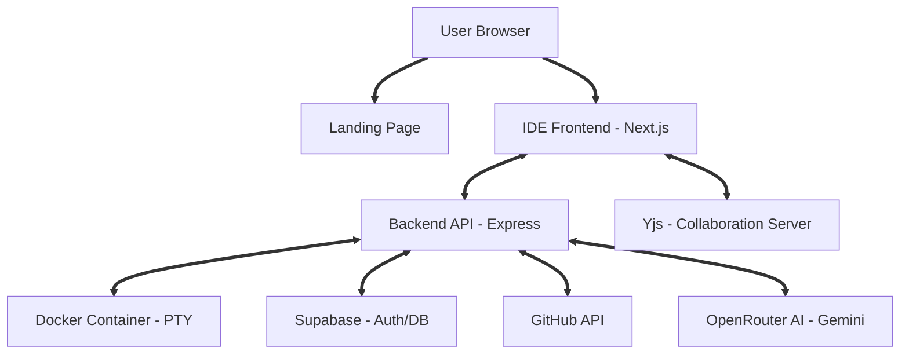

<div align="center">

  # 🚀 Code Forge Hub
  ### A Premium Cloud-Native IDE for the Modern Web

  [](https://github.com/)
  [](https://nextjs.org/)
  [](https://www.typescriptlang.org/)
  [](https://www.docker.com/)
  [](https://supabase.com/)
  [](LICENSE)

  [Features](#-features) • [Architecture](#-architecture) • [Project Structure](#-project-structure) • [Quick Start](#-quick-start) • [Production Deployment](#-production-deployment)
</div>

---

## 📖 Introduction

**Code Forge Hub** is a premium, cloud-powered IDE designed to bring the power of VSCode directly to your browser. Whether you're importing a local project or connecting to GitHub, Code Forge Hub provides a seamless, zero-latency development environment with integrated containerization, AI assistance, and real-time collaboration.

## 🏗️ Architecture & Project Structure

The project is split into three main areas, each with its own specific focus and documentation:

1. **[Frontend (`/frontend`)](./frontend/README.md)**
   - The React (Next.js) web application representing the IDE user interface.
   - Monaco Editor, xterm.js terminal, real-time presence, AI chat interface.
2. **[Backend (`/backend`)](./backend/README.md)**
   - Node.js Express server orchestrating Docker workspaces.
   - PTY terminal sessions, AI integration, GitHub operations, Yjs websocket synchronization.
3. **Landing Page (`/landing-page`)**
   - A standalone marketing site built in Next.js to provide optimized public-facing information without bogging down the IDE application.


```mermaid
graph TD
    A[User Browser] ==> B[Landing Page]
    A ==> C[IDE Frontend - Next.js]
    C <==> D[Backend API - Express]
    D <==> E[Docker Container - PTY]
    D <==> F[Supabase - Auth/DB]
    D <==> G[GitHub API]
    C <==> H[Yjs - Collaboration Server]
    D <==> I[OpenRouter AI - Gemini]
```

### 🛡️ Scalability & Isolation
- **User Isolation**: Every user gets a dedicated Docker container with strict resource limits.
- **Resource Management**: Projects of the same language share a container per user to optimize memory overhead.
- **Stateless Backend**: The Express.js backend can be horizontally scaled, while Supabase handles persistent state.
- **Robust Git-Sync**: Automated stashing and branch management to handle concurrent edits and safe code recovery.

---

## 🛠️ Tech Stack Overview

| Type | Technology | Logo |
| :--- | :--- | :---: |
| **AI** | OpenRouter, Gemini Flash | 🤖 |
| **Frontend** | Next.js 15, TailwindCSS, Framer Motion, Zustand | ⚛️ |
| **Backend** | Node.js, Express, Socket.io | 🟢 |
| **Terminal** | XTerm.js, Node-PTY | 🐚 |
| **Isolation** | Docker, Dockerode | 🐳 |
| **Cloud** | Supabase, GitHub API | ☁️ |
| **Collab** | Yjs, y-websocket, y-monaco | 🤝 |

---

## 🚀 Quick Start (Local Development)

### 📋 Prerequisites
- **Node.js** 20.x or higher
- **Docker** Desktop / Engine
- **Supabase** Project (URL & Anon Key)
- **GitHub** OAuth Application
- **OpenRouter** API Key (for AI features)

### ⚙️ Local Execution

For the best development experience, run each service in a separate terminal:

```bash
# Terminal 1: Backend
cd backend
npm install
npm run dev # Runs on port 4001

# Terminal 2: Frontend
cd frontend
npm install
npm run dev # Runs on port 4000

# Terminal 3: Landing Page
cd landing-page
npm install
npm run dev # Runs on port 3000
```

---

## 🌍 Production Deployment

Deploying Code Forge Hub requires setting up the Dockerized components and properly exposing them to the internet behind an API Gateway/Reverse Proxy (e.g., NGINX).

### 1. Global Environment Variables

Before deploying, ensure you configure the `.env` variables across the services.

- **Frontend (`frontend/.env.local`):**
  - `NEXT_PUBLIC_API_URL`: Your public API domain (e.g., `https://api.yourdomain.com`)
  - `NEXT_PUBLIC_SUPABASE_URL` / `NEXT_PUBLIC_SUPABASE_ANON_KEY`: Supabase connection keys

- **Landing Page (`landing-page/.env.local`):**
  - `NEXT_PUBLIC_APP_URL`: Your public Frontend domain (e.g., `https://app.yourdomain.com`)

- **Backend (`backend/.env`):**
  - `FRONTEND_URL`: Public domain of the IDE (`https://app.yourdomain.com`)
  - `OPENROUTER_API_KEY`: API Key for AI features
  - `GITHUB_CLIENT_ID` / `GITHUB_CLIENT_SECRET`: GitHub integration credentials

### 2. Frontend & Landing Page Setup

The static Next.js assets are pre-configured to be deployed easily using Docker Compose.

```bash
# Build and deploy frontend and landing page detached
docker-compose up -d --build
```
This deploys the Frontend to port `4000` and the Landing Page to port `3000`.

### 3. Backend Setup

The backend handles creating and managing Docker containers, so it must have access to the host machine's Docker engine. It's recommended to run it directly on the primary application server or cluster where workspace containers will live.

```bash
cd backend
npm install
npm run build
npm run start
```
*If you decide to containerize the backend itself, ensure you bind the Docker socket using `-v /var/run/docker.sock:/var/run/docker.sock` to give Dockerode permissions.*

### 4. Reverse Proxy Mapping

Use an NGINX or Caddy reverse proxy to expose your services on port 80/443:
- Route `yourdomain.com` -> `localhost:3000` (Landing Page)
- Route `app.yourdomain.com` -> `localhost:4000` (Frontend)
- Route `api.yourdomain.com` -> `localhost:4001` (Backend)

*Note: Ensure WebSocket support is enabled on the proxy for both the Next.js HMR (dev) and Socket.io / Yjs (production).*
